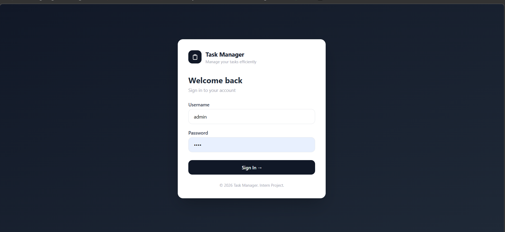
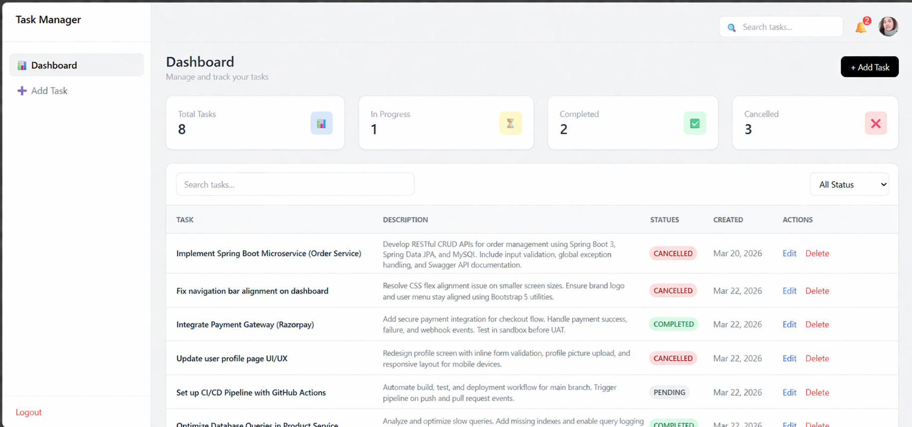
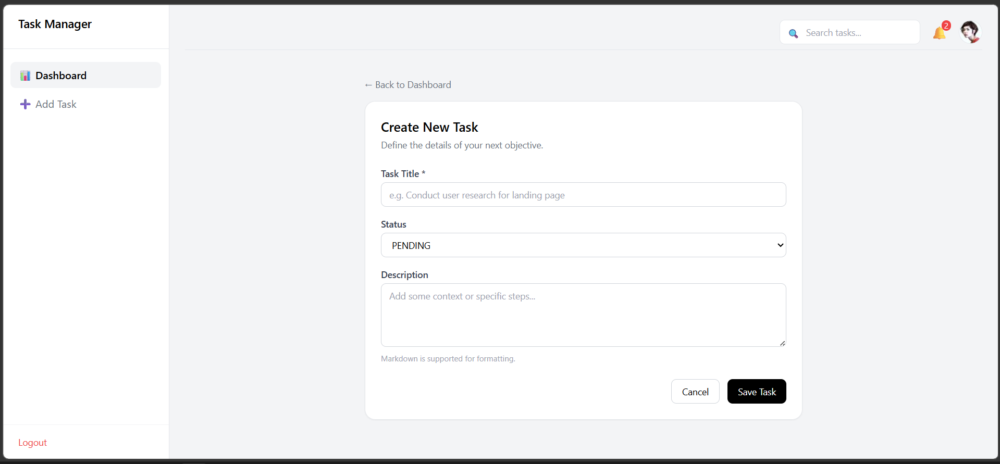
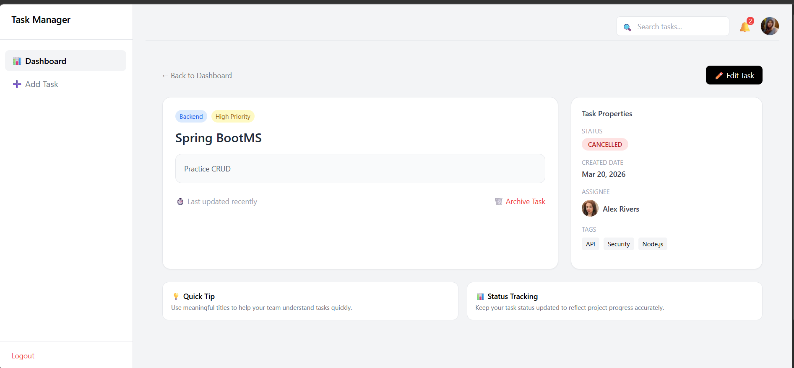

# 🚀 Task Manager Application

A full-stack Task Management System built using **Spring Boot (Backend)** and **Angular (Frontend)** with **JWT Authentication & Role-Based Authorization**.

---

## 📌 Features

### 🔐 Authentication

* User Registration
* User Login with JWT Token
* Secure password encryption (BCrypt)

### 👥 Role-Based Access

* **ADMIN**

    * Create Task
    * Update Task
    * Delete Task
* **USER**

    * View Tasks
    * Update Task Status (IN_PROGRESS, COMPLETED, CANCELED)

### 📋 Task Management

* Create, Edit, Delete Tasks
* View all tasks
* Update task status

---

## 🏗️ Tech Stack

### 🔹 Backend

* Java
* Spring Boot
* Spring Security
* JWT Authentication
* JPA / Hibernate
* MySQL

### 🔹 Frontend

* Angular
* TypeScript
* Tailwind CSS / Custom CSS

---

## 📂 Project Structure

### Backend

src/main/java/com/malisha/taskmanager

* config
* controller
* dto
* entity
* repository
* service
* util

### Frontend

src/app

* components
* pages
* services
* interceptors

---

## 🔑 API Endpoints

### 🔐 Auth

| Method | Endpoint           | Description       |
| ------ | ------------------ | ----------------- |
| POST   | /api/auth/register | Register user     |
| POST   | /api/auth/login    | Login & get token |

### 📋 Tasks

| Method | Endpoint               | Access      |
| ------ | ---------------------- | ----------- |
| GET    | /api/tasks             | USER, ADMIN |
| POST   | /api/tasks             | ADMIN       |
| PUT    | /api/tasks/{id}        | ADMIN       |
| DELETE | /api/tasks/{id}        | ADMIN       |
| PATCH  | /api/tasks/{id}/status | USER, ADMIN |

---

## 🔐 Authentication Flow

1. User logs in
2. Backend returns JWT token
3. Token stored in localStorage
4. Angular interceptor attaches token to every request
5. Backend validates token via JwtFilter

---

## ⚙️ Setup Instructions

### 🔹 Backend Setup

1. Open project in IntelliJ
2. Configure MySQL database in `application.properties`
3. Run Spring Boot application

### 🔹 Frontend Setup

```bash
npm install
ng serve
```

Open:

```
http://localhost:4200
```

---

## 🧪 Testing (Postman)

1. Register user → `/api/auth/register`
2. Login → `/api/auth/login`
3. Copy token
4. Add Bearer Token in Authorization
5. Test protected APIs

---

## 📸 Screenshots
### 🔐 Login Page
  
### 📊 Dashboard

### 📝 Task Management UI



---